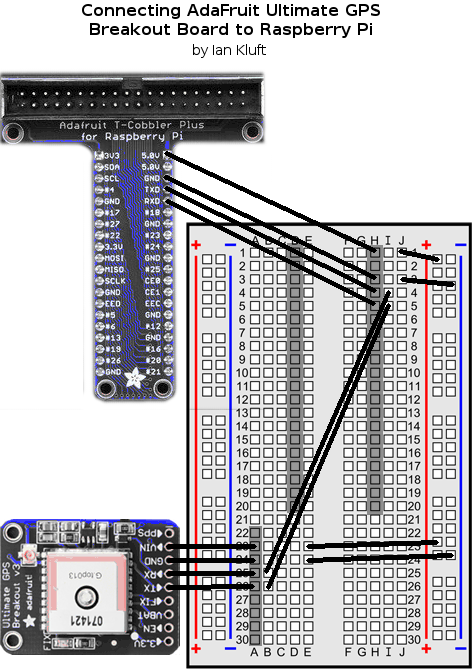

# Perl on Raspberry Pi scripts

I have a few scripts in this directory which demonstrate running Perl on a Raspberry Pi.

## [do-video](do-video) - Shuffle-play videos from a directory
The do-video script plays videos from a directory in random order. It looks in the user's home directory for either Videos or Movies directory. Or you can modify your copy of the script to use another. This can be useful for playing videos at a display kiosk or during indoor exercise.

### Installation
do-video uses the [omxplayer](http://elinux.org/Omxplayer) program which takes advantage of the Raspberry Pi's video hardware acceleration. Use the following command to install it.
	apt-get install omxplayer

## [gps-read.pl](gps-read.pl) - read data from a GPS
  
Though you could just use GPSD for this, gps-read.pl demonstrates Perl code to directly access the serial port in the Raspberry Pi's GPIO pins to read data from a GPS. This assumes the GPS outputs in standard NMEA format. For the specific example I used an [AdaFruit 746 Ultimate GPS Breakout Board](https://www.adafruit.com/products/746) and [T-Cobbler Plus GPIO interface](https://www.adafruit.com/products/2028). Note that this uses the 40-pin GPIO from the RasPi A+/B+ and later. At the time of this writing that's everything *except the original RasPi 1*, which has an older 22-pin interface and needs the original T-Cobbler (no plus) interface board and 22-pin cable.

### Installation
Run the following commands on the Raspberry Pi to install it.
* install modules from CPAN. (This will take a while. Press enter to accept the defaults at the prompts.)
	cpan install GPS::Serial Device::SerialPort
* change to superuser for installation steps which require it
	sudo -s
* We need to turn off the serial console. Edit /boot/cmdline.txt to remove any kernel boot parameter that looks like `console=serial0,115200`.
* We need to disable the login prompt on the serial port. (These are current for Raspbian Jessie in Feb 2017.)
	* On a RasPi 1/1+/2/Zero run these commands.
		systemctl stop serial-getty@ttyAMA0.service
		systemctl disable serial-getty@ttyAMA0.service
	* On a RasPi 3 run these commands.
		systemctl stop serial-getty@ttyS0.service
		systemctl disable serial-getty@ttyS0.service

## [serial-read.pl](serial-read.pl) - read data from serial port
This is a simpler and lower-level example which reads raw data from the serial port so you can see the raw NMEA strings from the GPS.
